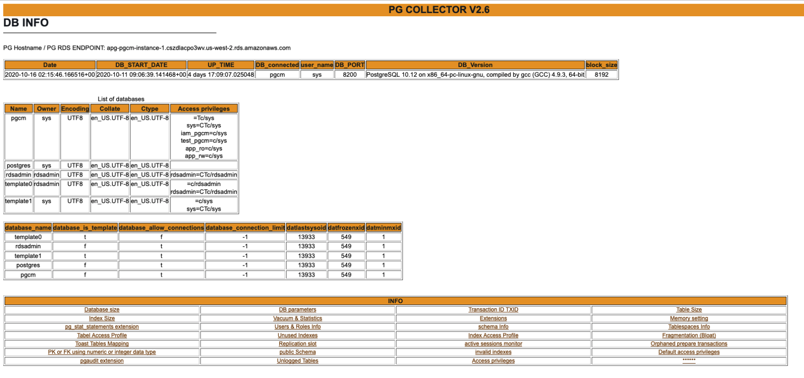

# PG Collector  

## Overview

PG Collector for [Postgresql](https://www.postgresql.org/) is a sql script that gathers valuable database information and presents it in a consolidated HTML file which provides a convenient way to view and navigate between different sections of the report.

PG Collector is safe to run on production environments and does not create any database objects to produce the output.

With PG Collector an operator gains insights on various aspects of the database, such as:
* Database size
* Configuration parameters
* Installed extensions
* Vacuum & Statistics
* Unused Indexes & invalid indexes
* Users & Roles Info
* Toast Tables Mapping
* Database schemas 
* Fragmentation (Bloat)
* Tablespaces Info
* Memory setting
* Tables and Indexes Size and info
* Transaction ID
* Replication slots
* public Schema info 
* Unlogged Tables

and more, please check the example reports 

## PG Collector report header 



## Example of PG Collector report 

[pg_collector v2.9](http://pg-collector.s3-website-us-west-2.amazonaws.com/pg_collector_postgres-2021-08-02_181348.html)

[pg_collector v2.7](http://pg-collector.s3-website-us-west-2.amazonaws.com/pg_collector_postgres-2020-12-14_053537.html)

All Sample reports in [sample report folder](https://github.com/awslabs/pg-collector/tree/main/sample_reports).


## PG Collector output

### Report name:
PG Collector script will generate HTML file using the following naming convention pg_colletcor_[DB Name]-[timestamp].html .

[DB Name] : is the database name that you are connected to.

```
Example : pg_collector_testdb-2020-10-10_030920.html
```


### Report location: 
PG Collector script will generate HTML file  under [/tmp](https://tldp.org/LDP/Linux-Filesystem-Hierarchy/html/tmp.html) directory. 


## How to run PG Collector script ( pg_collector.sql )

1- you need [psql](https://www.postgresql.org/docs/10/app-psql.html) to be able to connect to the postgresql DB and run the pg_collector.sql script 

2- Download pg_collector.sql in your laptop or the host that want to access the database from 

3- login to the database using psql 
```
psql -h [hostname or RDS endpoint] -p [Port] -d [Database name ] -U [user name] 
```
4- run the pg_collector.sql script 

```
\i pg_collector.sql 
\q
```
or use -f option in psql 

```
psql -h [hostname or RDS endpoint] -p [Port] -d [Database name ] -U [user name] -f pg_collector.sql 
```

Example :

```
mohamed@mydevhost ~ % psql -h testdb-instance-1.cimdlffuw.us-west-2.rds.amazonaws.com -p 5432 -d testdb -U mohamed
psql (9.4.8, server 10.6)
WARNING: psql major version 9.4, server major version 10.6.
         Some psql features might not work.
SSL connection (protocol: TLSv1.2, cipher: ECDHE-RSA-AES256-GCM-SHA384, bits: 256, compression: off)
Type "help" for help.

testdb=> \i pg_collector.sql
Output format is html.
Default footer is off.
testdb=> \q
mohamed@mydevhost ~ %ls -lhrt /tmp/pg_colletcor_*
-rw-r--r-- 1 mohamed mohamed 569K Oct  7 21:51 /tmp/pg_colletcor_testdb-2019-10-07_215146.html

```
5-  open the report using any internet browser


## Notes:
1- it is ok to see below errors while executing the pg_colletcor.sql script if you did not install pg_stat_statements extension

```
postgres=> \i pg_collector.sql
Output format is html.
Default footer is off.
psql:pg_collector.sql:481: ERROR:  relation "pg_stat_statements" does not exist
LINE 10: from pg_stat_statements
              ^
psql:pg_collector.sql:495: ERROR:  relation "pg_stat_statements" does not exist
LINE 10: from pg_stat_statements
              ^
psql:pg_collector.sql:509: ERROR:  relation "pg_stat_statements" does not exist
LINE 10: from pg_stat_statements
              ^
psql:pg_collector.sql:523: ERROR:  relation "pg_stat_statements" does not exist
LINE 10: from pg_stat_statements
              ^
postgres=> \q
```

2- if the Database have Tens of thousands of tables , some queries can take longer time .
use statement_timeout to Abort any statement that takes more than the specified number of milliseconds.
please check below example .  


```
postgres=> set statement_timeout=30000;
SET
postgres=> \i pg_collector.sql
Output format is html.
Report name and location: /tmp/pg_collector_postgres-2021-07-22_194944.html
psql:pg_collector.sql:1442: ERROR:  canceling statement due to statement timeout
postgres=>

```

3- It is acceptable to observe the following errors while executing the pg_collector.sql script on Amazon Aurora PostgreSQL if the Cluster Cache Manager is disabled.

```
postgres=> \i pg_collector.sql
Output format is html.
psql:/tmp/pg_collector.sql:2766: ERROR: Cluster Cache Manager is disabled
psql:/tmp/pg_collector.sql:2769: ERROR: Cluster Cache Manager is disabled
Report Generated Successfully
Report name and location: /tmp/pg_collector_postgres-2024-09-09_161216.html

```

# License

This library is licensed under the MIT-0 License. See the LICENSE file.