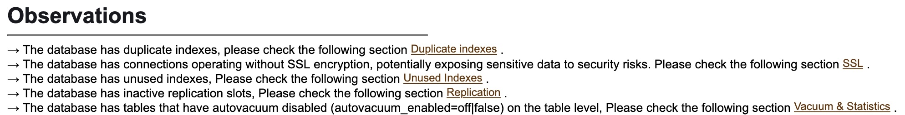
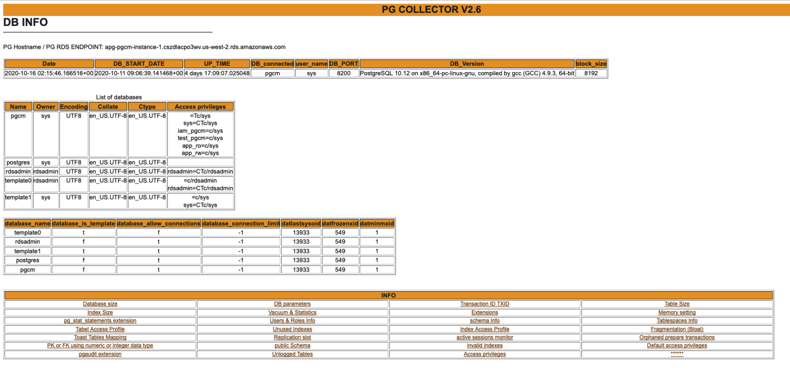

# PG Collector  

## Table of Contents
- [Overview](#overview)
- [PG Collector's Automated Database Health check](#pg-collectors-automated-database-health-check)
- [PG Collector report header](#pg-collector-report-header)
- [Example of PG Collector report](#example-of-pg-collector-report)
- [PG Collector output](#pg-collector-output)
- [How to run PG Collector script](#how-to-run-pg-collector-script--pg_collectorsql-)
- [Selective Section Execution](#selective-section-execution)
- [PG Collector & AI](#pg-collector--ai)
- [Notes](#notes)
- [License](#license)

## Overview

PG Collector for [Postgresql](https://www.postgresql.org/) is a sql script that gathers valuable database information and presents it in a consolidated HTML file which provides a convenient way to view and navigate between different sections of the report.

PG Collector is safe to run on production environments and does not create any database objects to produce the output.

With PG Collector an operator gains insights on various aspects of the database, such as:
* Database size
* Configuration parameters
* Installed extensions
* Vacuum & Statistics
* Unused Indexes & invalid indexes
* Users & Roles Info
* Toast Tables Mapping
* Database schemas 
* Fragmentation (Bloat)
* Tablespaces Info
* Memory setting
* Tables and Indexes Size and info
* Transaction ID
* Replication slots
* public Schema info 
* Unlogged Tables

and more, please check the example reports 

## PG Collector's Automated Database Health check

The Observations section has been implemented as an automated database health assessment system designed to identify potential database issues and provide actionable recommendations .

The observations section seamlessly integrates with existing PG Collector report sections, providing cross-references to detailed analysis and supporting data.

more health checks will be added with each new version .

Database Health check list :
```
   1- Duplicate indexes
   2- Invalid indexes
   3- Unused Indexes
   4- Autovacuum parameter
   5- Sequences with less than 10% of the remain values
   6- Orphaned prepared transactions
   7- Connections without SSL
   8- Enable_indexonlyscan parameter
   9- Excessive logging parameters
   10- Track_counts parameter
   11- Enable_indexscan parameter
   12- Synchronous_commit parameter
   13- Invalid databases
   14- Tables with more than 20% dead rows
   15- Transaction ID TXID (Wraparound)
   16- Tables that have autovacuum_enabled=off on table level
   17- Inactive replication slots
   18- Logical replication spill files
   19- Outdated Extensions
   20- Parameters pending restart
```
### Example of The Observations section

 

## PG Collector report header 



## Example of PG Collector report 

[pg_collector v2.9](http://pg-collector.s3-website-us-west-2.amazonaws.com/pg_collector_postgres-2021-08-02_181348.html)

[pg_collector v2.7](http://pg-collector.s3-website-us-west-2.amazonaws.com/pg_collector_postgres-2020-12-14_053537.html)

All Sample reports in [sample report folder](https://github.com/awslabs/pg-collector/tree/main/sample_reports).


## PG Collector output

### Report name:
PG Collector script will generate HTML file using the following naming convention pg_collector_[DB Name]-[timestamp].html .

[DB Name] : is the database name that you are connected to.

```
Example : pg_collector_testdb-2020-10-10_030920.html
```


### Report location: 
PG Collector generates the HTML report under [/tmp](https://tldp.org/LDP/Linux-Filesystem-Hierarchy/html/tmp.html) by default.

To save the report to a different location, pass `-v outdir=/your/path`:

```bash
psql -h [hostname] -p [port] -d [dbname] -U [user] -v outdir=/home/user/reports -f pg_collector.sql
```

> **Note:** The output directory must already exist before running the script. PG Collector will not create it automatically.
> If the directory does not exist, psql cannot open the output file and the HTML report will be printed to the terminal screen instead of saved to a file.


## How to run PG Collector script ( pg_collector.sql )

1- you need [psql](https://www.postgresql.org/docs/current/app-psql.html) to be able to connect to the postgresql DB and run the pg_collector.sql script 

It is recommended that you use a psql version that matches the same server major version or higher .

2- Download pg_collector.sql in your laptop or the host that want to access the database from 

3- login to the database using psql 
```
psql -h [hostname or RDS endpoint] -p [Port] -d [Database name ] -U [user name] 
```
4- run the pg_collector.sql script 

```
\i pg_collector.sql 
\q
```
or use -f option in psql 

```
psql -h [hostname or RDS endpoint] -p [Port] -d [Database name ] -U [user name] -f pg_collector.sql 
```

Example :

```
mohamed@mydevhost ~ % psql -h testdb-instance-1.cimdlffuw.us-west-2.rds.amazonaws.com -p 5432 -d testdb -U mohamed
psql (9.4.8, server 10.6)
WARNING: psql major version 9.4, server major version 10.6.
         Some psql features might not work.
SSL connection (protocol: TLSv1.2, cipher: ECDHE-RSA-AES256-GCM-SHA384, bits: 256, compression: off)
Type "help" for help.

testdb=> \i pg_collector.sql
Output format is html.
Output format is aligned.
Query buffer reset (cleared).
Report Generated Successfully
Report name and location:  /tmp/pg_collector_testdb-2019-10-07_215146.html
testdb=> \q
mohamed@mydevhost ~ %ls -lhrt /tmp/pg_collector_*
-rw-r--r-- 1 mohamed mohamed 569K Oct  7 21:51 /tmp/pg_collector_testdb-2019-10-07_215146.html

```
5-  open the report using any internet browser


## Selective Section Execution 

PG Collector supports running a specific sections of the report instead of the full report. This is useful for:

- Quick focused troubleshooting (e.g., check vacuum stats only or Observations (Health checks))
- Large databases where a full report takes too long
- Targeted Aurora diagnostics

### List Available Sections

```bash
psql -v help=t -f pg_collector.sql
```

Output:
```
PG Collector - Available Sections:

  Variable Name        Description
  ---------------      ----------------------------------------
  observations    - Observations (Health checks)
  db_size         - Database size
  txid            - Transaction ID TXID (Wraparound)
  table_size      - Table Size
  index_size      - Index Size
  vacuum          - Vacuum & Statistics
  extensions      - Extensions
  memory          - Memory setting
  pgss            - pg_stat_statements extension
  users           - Users & Roles Info
  schema          - Schema Info
  tablespaces     - Tablespaces Info
  table_access    - Table Access Profile
  unused_idx      - Unused Indexes
  index_access    - Index Access Profile
  bloat           - Fragmentation (Bloat)
  toast           - Toast Tables Mapping
  replication     - Replication
  sessions        - Sessions/Connections Info
  prepared_txn    - Orphaned prepared transactions
  pk_fk           - PK or FK using numeric/integer
  public_schema   - public Schema
  invalid_idx     - Invalid indexes
  privileges      - Access privileges
  default_privileges - Default access privileges
  pgaudit         - pgaudit extension
  unlogged_tables - Unlogged Tables
  ssl             - SSL
  bg_processes    - Background processes
  mxid            - Multixact ID MXID
  temp            - Temp Tables
  large_objects   - Large objects
  partitions      - Partition tables
  sequences       - Sequences
  pg_hba          - pg_hba.conf
  dup_idx         - Duplicate indexes
  functions       - Functions statistics
  db_load         - DB Load
  triggers        - Triggers
  pg_config       - pg_config
  db_params       - DB parameters
  idx_progress    - Index Creation Progress
  invalid_db      - Invalid databases
  mat_views       - Materialized Views
  foreign_servers - Foreign Servers
  pg_shdepend     - pg_shdepend (shared object dependencies)
  fk_no_index     - FK without index

  ---------- Aurora PostgreSQL ----------
  aurora_version          - Aurora version
  aurora_builtins         - Aurora built-in functions
  aurora_instance_id      - Aurora db instance identifier
  aurora_cluster          - Aurora cluster instances
  aurora_replica_lag      - Aurora reader instances - Replica Lag
  aurora_ccm              - Aurora cluster cache management (CCM)
  aurora_global_db        - Aurora global db status
  aurora_wait_events      - Aurora wait event stat
  aurora_qpm              - Query Plan Management (QPM)
  aurora_dml              - Aurora DML activity
  aurora_memctx           - Process memory context usage
  aurora_wal_cache        - Logical replication write-through cache
```

### Run Specific Sections

Pass `-v fullmod=f` to enable selective mode, then `-v <section>=t` for each section you want:

```bash
# Vacuum & Statistics only
psql -h [hostname] -p [port] -d [dbname] -U [user] -v fullmod=f -v vacuum=t -f pg_collector.sql

# Vacuum and Replication together
psql -h [hostname] -p [port] -d [dbname] -U [user] -v fullmod=f -v vacuum=t -v replication=t -f pg_collector.sql

# Observations (Health checks)
psql -h [hostname] -p [port] -d [dbname] -U [user] -v fullmod=f -v observations=t -f pg_collector.sql

# Size analysis
psql -h [hostname] -p [port] -d [dbname] -U [user] -v fullmod=f -v db_size=t -v table_size=t -v index_size=t -f pg_collector.sql
```

### Full Report (Default)

No extra variables needed — works exactly as before:

```bash
psql -h [hostname] -p [port] -d [dbname] -U [user] -f pg_collector.sql
```

### Terminal Output in Selective Mode

```
SET
statement_timeout set to 5 minutes. To change, edit the SET statement_timeout line in the script.
Output format is html.
Generating specific sections in the Report:
  - Vacuum & Statistics
  - Replication
Output format is aligned.
Query buffer reset (cleared).
Report Generated Successfully
Report name and location: /tmp/pg_collector_mydb-2026-06-15_111308.html
```

The HTML report header will show a "Partial Report" banner listing the included sections with clickable links. The DB INFO header (version, uptime, host) always runs regardless of mode.

> **Note:** Only the value `t` enables a section. Any other value (`f`, `0`, or not set) skips the section.

## PG Collector & AI

PG Collector HTML reports are designed for humans — beautiful tables, clickable navigation, everything formatted nicely. But when feeding reports into an AI model, all that HTML markup translates to a lot of unnecessary tokens.

### Convert HTML → Markdown

Use [Pandoc](https://pandoc.org/installing.html) to strip the HTML markup and retain only the structured data. This reduces token consumption by ~70% vs raw HTML, making AI analysis significantly faster and cheaper.

```bash
pandoc pg_collector_report.html -f html -t markdown -o pg_collector_report.md
```

Example:

```bash
pandoc pg_collector_postgres-2026-02-13_053714.html -f html -t markdown -o pg_collector_postgres-2026-02-13_053714.md
```

## Notes:
1- it is ok to see below errors while executing the pg_collector.sql script if you did not install pg_stat_statements extension

```
postgres=> \i pg_collector.sql
Output format is html.
Default footer is off.
psql:pg_collector.sql:481: ERROR:  relation "pg_stat_statements" does not exist
LINE 10: from pg_stat_statements
              ^
psql:pg_collector.sql:495: ERROR:  relation "pg_stat_statements" does not exist
LINE 10: from pg_stat_statements
              ^
psql:pg_collector.sql:509: ERROR:  relation "pg_stat_statements" does not exist
LINE 10: from pg_stat_statements
              ^
psql:pg_collector.sql:523: ERROR:  relation "pg_stat_statements" does not exist
LINE 10: from pg_stat_statements
              ^
postgres=> \q
```

2- If the database has tens of thousands of tables, some queries can take longer time.
The script sets `statement_timeout = 5 minutes` by default to prevent any single query from hanging indefinitely.
If a query exceeds 5 minutes, it will be cancelled and the script will continue to the next section.
To change the default timeout, edit the `SET statement_timeout` line at the top of the pg_collector.sql script.

```
SET
statement_timeout set to 5 minutes. To change, edit the SET statement_timeout line in the script.
Output format is html.
Output format is aligned.
Query buffer reset (cleared).
Report Generated Successfully
Report name and location: /tmp/pg_collector_testdb-2026-06-11_223030.html
```

3- It is acceptable to observe the following errors while executing the pg_collector.sql script on Amazon Aurora PostgreSQL if the Cluster Cache Manager is disabled.

```
postgres=> \i pg_collector.sql
Output format is html.
psql:/tmp/pg_collector.sql:2766: ERROR: Cluster Cache Manager is disabled
psql:/tmp/pg_collector.sql:2769: ERROR: Cluster Cache Manager is disabled
Report Generated Successfully
Report name and location: /tmp/pg_collector_postgres-2024-09-09_161216.html

```

# License

This library is licensed under the MIT-0 License. See the LICENSE file.
